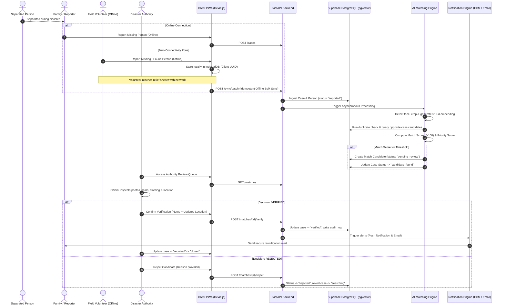

# REUNITE-X 🌐🆘

> **Next-Generation Disaster Response Missing Persons Reunification Platform**  
> *Engineered for extreme disaster environments: zero-connectivity offline synchronization, AI facial vector matching, and mandatory human authority verification.*

---

## 🌟 Overview & Core Mission

During major humanitarian crises—cyclones, severe flooding, earthquakes, tsunamis, and wildfires—thousands of families are separated in chaotic evacuations. Communication infrastructures collapse, resulting in zero-connectivity blackouts across relief shelters and affected areas.

**REUNITE-X** solves this crisis through three core pillars:
1. **Offline-First PWA (Zero-Connectivity Ingestion)**: Field volunteers register missing and found victims offline using local IndexedDB storage (Dexie.js). Reports auto-sync with exponential backoff and idempotent conflict handling when connectivity is restored.
2. **AI Multimodal Candidate Matching**: Automated face detection, alignment, and 512-dimensional vector embedding extraction using deep learning (`facenet-pytorch`/`InsightFace`) paired with PostgreSQL `pgvector` HNSW cosine indexing. Blended multimodal scoring incorporates demographic, geospatial, and clothing text features.
3. **Mandatory Human-in-the-Loop Authority Verification**: **Zero automated status updates or reunification decisions**. All candidate matches undergo review by verified emergency officials on a dedicated side-by-side comparison dashboard before notifications are dispatched.

---

## 🏗️ Architecture & Workflow



---

## 📂 Monorepo Structure

```text
CodeX3-disater/
├── backend/                  # FastAPI Application
│   ├── app/
│   │   ├── ai/               # Face detection, embedding, scoring & matching
│   │   ├── core/             # Configuration, Supabase client, security & auth guards
│   │   ├── models/           # SQLAlchemy / SQL models & enums
│   │   ├── schemas/          # Pydantic validation schemas
│   │   ├── services/         # Business logic (cases, sync, search, notifications)
│   │   ├── routers/          # API endpoints (cases, sync, matches, auth, stats)
│   │   └── main.py           # Application entrypoint & middleware
│   ├── tests/                # Pytest unit & integration test suites
│   ├── requirements.txt      # Python dependencies
│   └── .env.example
├── frontend/                 # React 19 + Vite PWA
│   ├── public/               # Web app manifest, icons, service worker assets
│   ├── src/
│   │   ├── api/              # Axios / Fetch client with offline interceptors
│   │   ├── components/       # UI widgets, badges, offline sync indicators
│   │   ├── context/          # Auth & offline sync state context
│   │   ├── db/               # Dexie.js IndexedDB schema & sync queue logic
│   │   ├── hooks/            # Custom hooks (useNetworkStatus, useOfflineSync)
│   │   ├── pages/            # Mobile-first views (Reporting, Tracker, Dashboard)
│   │   └── services/         # Mapbox/Google adapter, push notifications
│   ├── package.json
│   ├── vite.config.js        # Vite + vite-plugin-pwa Workbox config
│   └── .env.example
├── supabase/                 # Supabase PostgreSQL Database
│   ├── migrations/
│   │   ├── 001_initial_schema.sql         # Base tables, enums, sequences
│   │   ├── 002_pgvector_and_embeddings.sql# Vector extension, HNSW cosine index
│   │   ├── 003_rls_policies.sql           # Role-based RLS, Minor data masking
│   │   └── 004_triggers_and_functions.sql # Auditing, timestamp automation
│   ├── seed.sql              # Synthetic test data for local simulation
│   └── config.toml
├── docs/                     # Specifications & Design Documents
│   ├── ARCHITECTURE.md       # Full architecture & security boundaries
│   ├── WORKFLOW.md           # End-to-end lifecycle documentation
│   └── DATABASE.md           # Entity relationship dictionary & RLS matrix
├── .env.example              # Consolidated environment variable template
├── .gitignore
└── README.md
```

---

## 🛡️ Security, Privacy & Minor Protection

- **Minor Shielding Protocol**: For missing children under 18 (`is_minor = true`), contact telephone numbers and specific street addresses are masked across all public search views.
- **Private Media Storage**: Photos are stored in a private Supabase bucket (`case-photos`) accessible only via short-lived signed URLs.
- **Immutable Audit Logging**: Every view, status change, and official verification creates an unalterable log in `audit_log`.
- **Role-Based Access Control**: Strict separation between `public`, `volunteer`, `authority`, and `admin` personas.

---

## 🚀 Build Phases Roadmap

- [x] **Phase 1: Architecture, Planning & Database Schema** (Architecture diagram, folder layout, pgvector migrations, RLS policies, documentation)
- [ ] **Phase 2: Backend Foundation** (FastAPI, Supabase Auth integration, CRUD endpoints, Swagger docs)
- [ ] **Phase 3: Frontend Foundation** (Vite, Tailwind, PWA shell, reporting forms, camera intake)
- [ ] **Phase 4: Offline Engine** (Dexie.js IndexedDB, background sync queue, idempotent `/sync/batch`)
- [ ] **Phase 5: AI Multimodal Engine** (OpenCV face detection, embedding vectors, cosine search, weighted fusion scoring)
- [ ] **Phase 6: Authority Review Dashboard** (Side-by-side inspection, verify/reject workflow, audit trail)
- [ ] **Phase 7: Geospatial Maps & Notifications** (Swappable Mapbox/Google maps, FCM push & Email fallback)
- [ ] **Phase 8: Testing & Verification** (Pytest backend suite, Vitest frontend tests, Postman collection, synthetic data seeding)
- [ ] **Phase 9: Production Deployment** (Vercel frontend, Render backend, Supabase production instance, CI/CD pipeline)
