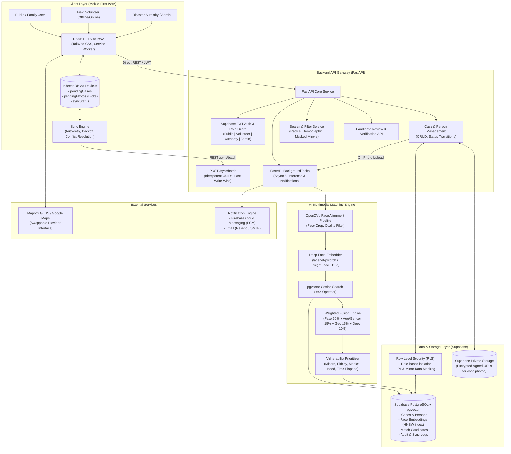
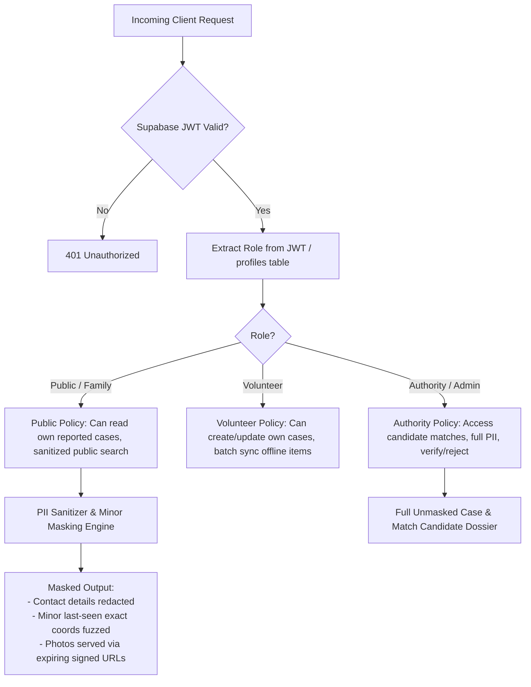
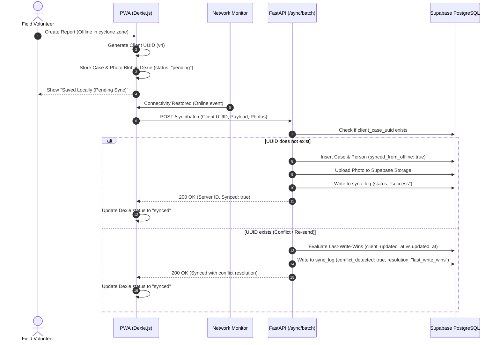

# REUNITE-X: Architecture Specification

## 1. Executive Summary

**REUNITE-X** is a mission-critical, disaster-response missing persons reunification platform engineered for resilient operation in extreme conditions (cyclones, floods, earthquakes, landslides). It bridges the gap between field volunteers operating in low/zero connectivity and central emergency authorities, combining **Offline-First PWA capabilities**, **AI-powered Multimodal Face Matching**, and **Mandatory Human-in-the-Loop Authority Verification**.

---

## 2. High-Level System Architecture



---

## 3. Technology Stack Justification & Role Matrix

| Component | Technology | Rationale & Responsibility |
| :--- | :--- | :--- |
| **Frontend** | React 19 + Vite + Tailwind CSS | Fast compilation, modern hooks, highly responsive mobile-first UI with dark/high-contrast emergency themes. |
| **Offline Storage** | Dexie.js (IndexedDB wrapper) | Client-side persistent relational storage for cases, high-res photos stored as binary `Blob`, sync state tracking. |
| **Service Worker** | `vite-plugin-pwa` (Workbox) | Caching app shell, icons, offline fallback pages, offline map assets. |
| **Backend API** | Python 3.12+ / FastAPI | High throughput async I/O, automatic Swagger OpenAPI docs generation, native Pydantic data validation. |
| **Database** | Supabase PostgreSQL + `pgvector` | Managed PostgreSQL with HNSW vector indexing for millisecond-latency 512-dimensional face embedding retrieval. |
| **Authentication** | Supabase Auth (GoTrue) | JWT-based auth with custom user metadata and database roles (`public`, `volunteer`, `authority`, `admin`). |
| **File Storage** | Supabase Storage (`case-photos` bucket) | Private access only. Media retrieved strictly through time-limited signed URLs generated by the backend. |
| **AI Inference** | OpenCV + facenet-pytorch / InsightFace | Face detection (Haar / MTCNN / RetinaFace), alignment, 512-dimensional face vector extraction, Cosine similarity. |
| **Maps** | Mapbox GL JS (Swappable Provider) | Clustered markers for last-seen and found points, offline tile caching strategies, swappable for Google Maps. |
| **Notifications** | Firebase Cloud Messaging (FCM) + Resend | Real-time push alerts to volunteers and family members upon authority verification, email notifications as reliable fallback. |

---

## 4. Security, Privacy & Minor Protection Boundaries



### Privacy & Protection Guardrails:
1. **Consent Protocol**: Mandatory affirmative consent logged with timestamp during report creation.
2. **Minor Protection Policy**: For missing individuals under 18 years of age (`is_minor = true`), contact telephone numbers and specific house-level addresses are redacted from all public search results.
3. **No Direct Public AI Matching**: The public cannot run automated face searches against unverified victims. Matches are purely computed internally and routed to the **Authority Verification Queue**.
4. **Human Verification Barrier**: **Zero auto-confirmations**. The AI engine only assigns a `candidate_found` status; transition to `verified` requires an authenticated emergency official's cryptographic record.
5. **Private Storage**: No public S3/Supabase bucket URLs. All photos are stored under private ACLs; the backend generates signed URLs with a 15-minute expiry.
6. **Immutable Audit Trail**: Every case view, match generation, verification, and rejection is recorded with actor ID, IP address, timestamp, and modification diff in `audit_log`.

---

## 5. Offline Sync & Idempotency Architecture



---

## 6. AI Multimodal Matching Pipeline

```mermaid
flowchart LR
    PhotoIn[Input Photo] --> FaceDet[Face Detection & Landmark Alignment]
    FaceDet --> QualityCheck{Quality / Face Check}
    QualityCheck -- No Face / Corrupted --> FlagManual[Flag for Manual Review / No Embedding]
    QualityCheck -- Valid Face --> FaceCrop[112x112 / 160x160 Cropped Face]
    
    FaceCrop --> Embedder[InsightFace / FaceNet 512-d Embedding]
    Embedder --> VectorDB[(pgvector HNSW Cosine Search)]
    
    VectorDB --> TopK[Top-K Candidates with Cosine Sim > 0.60]
    
    TopK --> MultiModal[Multimodal Fusion Scoring Engine]
    
    subgraph MultiModalFormula ["Scoring Formula"]
        W1["Face Sim (60%)"]
        W2["Age & Gender (15%)"]
        W3["Geo Distance (15%)"]
        W4["Description/Clothing (10%)"]
    end
    
    MultiModal --> Blend[Match Score: 0 - 100]
    Blend --> PriorityCalc[Priority Score Calculation\n+ Child (+20)\n+ Elderly (+15)\n+ Medical Need (+15)\n+ Hours Elapsed]
    PriorityCalc --> CandidateQueue[Match Candidates Table\nstatus: pending_review]
    CandidateQueue --> HumanAuth[Authority Review Dashboard\nSide-by-side Inspection]
```

---

## 7. Swappable Map Provider Architecture

The frontend map module implements an abstract adapter pattern:
- `MapProviderAdapter`: Common interface for:
  - `renderMap(container, options)`
  - `addClusteredMarkers(cases)`
  - `onMarkerClick(callback)`
  - `flyTo(coordinates, zoom)`
- Implementations:
  - `MapboxGLAdapter` (default high-performance WebGL clustering)
  - `GoogleMapsAdapter` (seamless fallback via configuration flag `VITE_MAP_PROVIDER=google|mapbox`)
