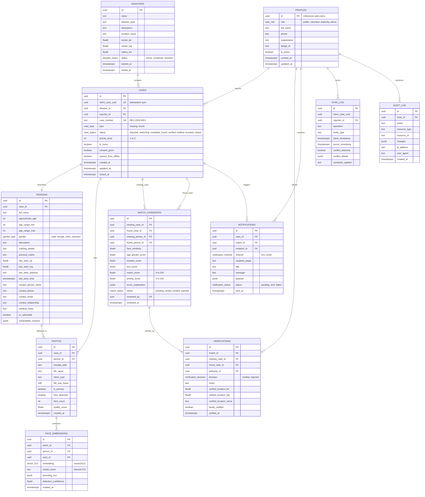

# REUNITE-X: Database Architecture & Schema Specification

This document details the PostgreSQL database design, extensions, table schemas, pgvector HNSW indexing, RLS (Row Level Security) authorization rules, and data masking policies.

---

## 1. Entity-Relationship Diagram (ERD)



---

## 2. Table Details & Optimization Indexes

### `face_embeddings` Vector Indexing
```sql
-- HNSW index using cosine distance (vector_cosine_ops)
CREATE INDEX idx_face_embeddings_vector 
ON face_embeddings 
USING hnsw (embedding vector_cosine_ops)
WITH (m = 16, ef_construction = 64);
```
- **Dimension**: 512-dimensional floating point vector (`vector(512)`).
- **Metric**: Cosine distance ($<=>$ operator in pgvector).
- **Performance**: Sub-10ms approximate nearest neighbor query over hundreds of thousands of face records.

### Location & Status Filter Indexes
```sql
CREATE INDEX idx_persons_location ON persons (last_seen_lat, last_seen_lng);
CREATE INDEX idx_cases_status ON cases (status);
CREATE INDEX idx_cases_disaster ON cases (disaster_id);
CREATE INDEX idx_cases_client_uuid ON cases (client_case_uuid);
CREATE INDEX idx_matches_status ON match_candidates (status);
CREATE UNIQUE INDEX idx_matches_unique_pair ON match_candidates (missing_case_id, found_case_id);
```

---

## 3. Row Level Security (RLS) Policy Matrix

| Table | Public / Anonymous | Volunteer (Field) | Authority / Admin |
| :--- | :--- | :--- | :--- |
| **`profiles`** | Read own profile; Update own profile | Read own profile; Update own profile | Read all profiles; Manage roles |
| **`disasters`** | Read active disasters | Read active disasters | Full CRUD |
| **`cases`** | View public sanitized subset; Insert new report; Read own reported | Insert reports (offline sync); Read own created reports | Full CRUD; Update status transitions |
| **`persons`** | View safe attributes (name, age, clothing, general area). **PII & Minor contacts masked.** | Insert & read persons on own cases | Full access to complete medical & contact data |
| **`photos`** | Access signed URLs of public cases only | Upload photos to own cases; View own photos | Full access to all photo metadata & signed URLs |
| **`face_embeddings`** | **BLOCKED (No Access)** | **BLOCKED (No Access)** | Read-only for similarity queries & candidate analysis |
| **`match_candidates`**| **BLOCKED (No Access)** | **BLOCKED (No Access)** | Full access to review queue, score breakdown & decision |
| **`verifications`** | Read verification receipt of own reunited case | Read verification receipt | Full insert, verify/reject decisions |
| **`sync_log`** | Write own sync events | Write own sync events; Read own failures | Full read & audit access |
| **`audit_log`** | **BLOCKED (No Access)** | **BLOCKED (No Access)** | Append-only system; Admin read-only |

---

## 4. Minor Protection & Sensitive Data Redaction Function

```sql
-- Public view sanitization function
CREATE OR REPLACE FUNCTION get_sanitized_person_details(p persons, user_role text)
RETURNS jsonb AS $$
BEGIN
    -- Authorities and Admins see complete information
    IF user_role IN ('authority', 'admin') THEN
        RETURN to_jsonb(p);
    END IF;

    -- If person is a minor or user is public, redact sensitive phone/email/exact location
    RETURN jsonb_build_object(
        'id', p.id,
        'case_id', p.case_id,
        'full_name', p.full_name,
        'approximate_age', p.approximate_age,
        'gender', p.gender,
        'description', p.description,
        'clothing_details', p.clothing_details,
        'physical_marks', p.physical_marks,
        'last_seen_address', p.last_seen_address,
        'last_seen_time', p.last_seen_time,
        'is_vulnerable', p.is_vulnerable,
        'is_minor', (p.approximate_age < 18),
        'contact_person_name', CASE WHEN p.approximate_age < 18 THEN 'REDACTED - CONTACT RELIEF AUTHORITY' ELSE p.contact_person_name END,
        'contact_phone', CASE WHEN p.approximate_age < 18 THEN 'REDACTED' ELSE '***-***-' || RIGHT(p.contact_phone, 4) END,
        'contact_email', 'REDACTED',
        'medical_notes', CASE WHEN p.medical_notes IS NOT NULL THEN 'Medical attention required' ELSE NULL END
    );
END;
$$ LANGUAGE plpgsql SECURITY DEFINER;
```
